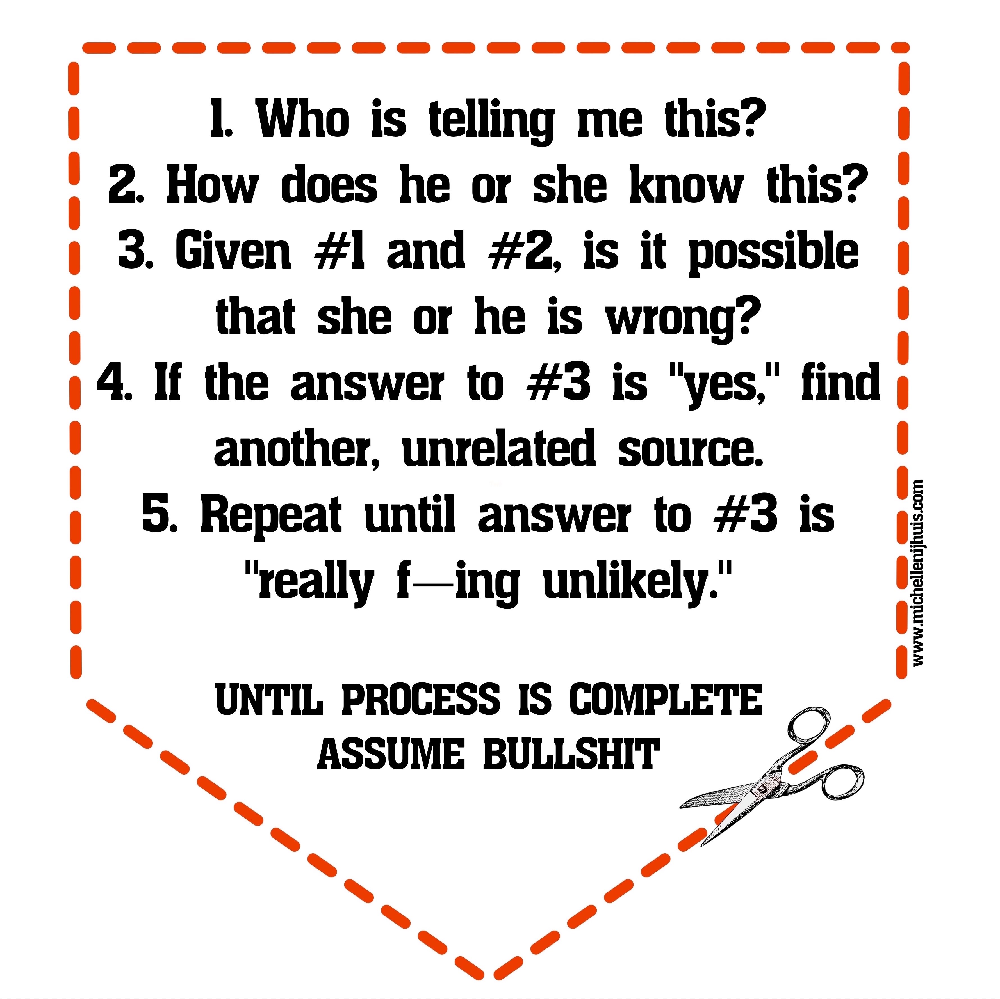

# Zawansowane Języki Programowania, 17/18

Literatura dla języków obiektowych.

. Refactoring https://martinfowler.com/books/refactoringRubyEd.html[Ruby Edition],
  https://martinfowler.com/books/refactoring.html[Java Edition]
. http://helion.pl/ksiazki/czysty-kod-podrecznik-dobrego-programisty-robert-c-martin,czykov.htm#format/e[Czysty kod. Podręcznik dobrego programisty] (ebook)

Narzędzia:

. Linters
. Code smell detectors (and brothers & sisters)
.. https://github.com/troessner/reek[reek] (for Ruby language)
.. https://github.com/bbatsov/rubocop[rubocop] – static code analyzer & style guide
. Editors
.. https://atom.io[Atom]

## Refactoring (techniki)

Kod po refactoringu łatwiej zrozumieć i rozszerzać
(szybciej piszemy zaawansowany kod, robimy mniej błędów).

Jak?

. Usuwamy nadmiarowy kod.
. W trakcie refactoringu zmienia się nasze rozumienie cudzego kodu.
. Nie musimy pamiętać co stary kod robił.
. Piszemy kod szybciej.

Clean code & bad smells.

. Common design problems.
. Unclear, duplicated, or unnecessary complicated code.

Przykład z biblioteki
https://github.com/troessner/reek[Code smell detector for Ruby].

```ruby
# Smelly class
class Smelly
  # This will reek of UncommunicativeMethodName
  def x
    y = 10 # This will reek of UncommunicativeVariableName
  end
end
```

```sh
reek smelly.rb
Inspecting 1 file(s):
S

smelly.rb -- 2 warnings:
  [4]:UncommunicativeMethodName: Smelly#x has the name 'x' [https://github.com/troessner/reek/blob/master/docs/Uncommunicative-Method-Name.md]
  [5]:UncommunicativeVariableName: Smelly#x has the variable name 'y' [https://github.com/troessner/reek/blob/master/docs/Uncommunicative-Variable-Name.md]
```



Source: http://www.lastwordonnothing.com/2014/04/29/the-pocket-guide-to-bullshit-prevention/[The Pocket Guide to Bullshit Prevention] by Michelle Nijhuis
